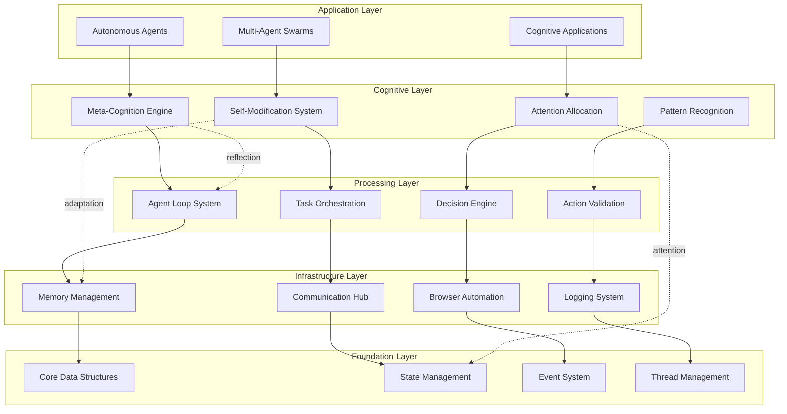
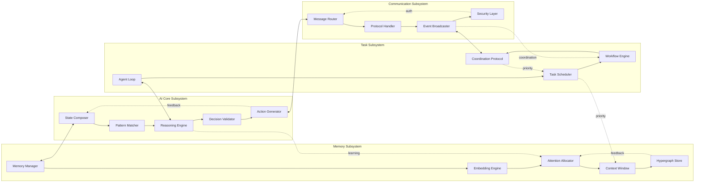
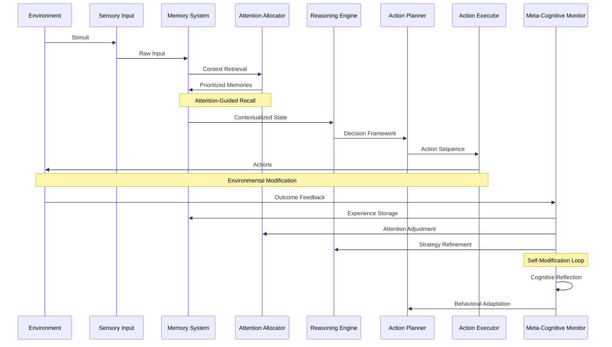
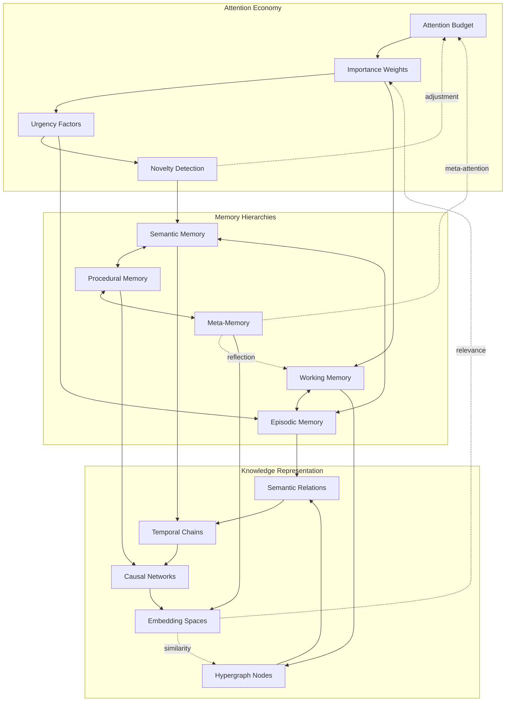
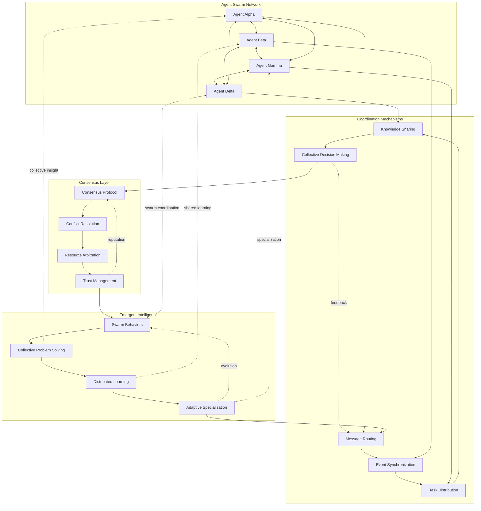
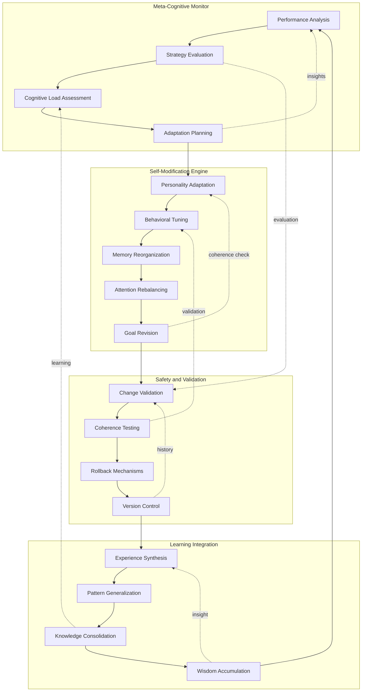

# Technical Architecture Documentation

This document provides a comprehensive technical overview of the ElizaOS C++ cognitive agent framework, including detailed architectural diagrams, subsystem interactions, and meta-cognitive commentary on the design philosophy.

## Table of Contents

1. [High-Level System Overview](#high-level-system-overview)
2. [Core Subsystem Architecture](#core-subsystem-architecture)
3. [Cognitive Processing Pipeline](#cognitive-processing-pipeline)
4. [Memory and Attention Systems](#memory-and-attention-systems)
5. [Distributed Agent Coordination](#distributed-agent-coordination)
6. [Self-Modification and Meta-Cognition](#self-modification-and-meta-cognition)
7. [Pattern Recognition and Emergence](#pattern-recognition-and-emergence)
8. [Meta-Cognitive Commentary](#meta-cognitive-commentary)

---

## High-Level System Overview

The ElizaOS C++ framework implements a layered cognitive architecture that enables emergent intelligence through the interaction of specialized subsystems. Each layer builds upon the foundations provided by lower layers, creating a hierarchical yet interconnected cognitive substrate.

**Architectural Principles:**
- **Layered Abstraction**: Each layer provides clear abstractions while maintaining flexibility
- **Emergent Intelligence**: Complex behaviors emerge from simple component interactions
- **Feedback Loops**: Meta-cognitive feedback enables continuous adaptation and improvement
- **Modular Design**: Components can be developed, tested, and evolved independently

---

## Core Subsystem Architecture

This diagram illustrates the detailed interactions between the core subsystems that form the foundation of the cognitive architecture.

**Key Design Features:**
- **Circular Dependencies**: Managed through careful interface design and dependency injection
- **Bidirectional Communication**: Enables rich feedback and coordination between subsystems
- **Meta-Cognitive Loops**: Self-reflective feedback mechanisms for continuous improvement
- **Attention Flow**: Attention allocation influences all subsystem priorities and resource usage

---

## Cognitive Processing Pipeline

The cognitive processing pipeline represents the flow of information and decision-making within a single agent, from perception through action execution.

**Processing Phases:**

1. **Perception Phase**: Environmental input processing and filtering
2. **Memory Retrieval**: Context-aware memory activation and attention allocation
3. **Reasoning Phase**: Pattern matching and logical inference
4. **Planning Phase**: Goal-oriented action sequence generation
5. **Execution Phase**: Action validation and environmental interaction
6. **Reflection Phase**: Meta-cognitive analysis and system adaptation

---

## Memory and Attention Systems

The memory architecture implements a sophisticated attention-based system inspired by cognitive science research and ECAN (Economic Attention Networks) principles.

**Memory Features:**
- **Dynamic Attention Allocation**: Resources directed based on importance, urgency, and novelty
- **Hierarchical Memory Structure**: Different memory types for different cognitive functions
- **Hypergraph Knowledge Representation**: Rich relational structures for complex knowledge
- **Embedding-Based Similarity**: Neural embedding spaces for semantic retrieval
- **Meta-Memory Capabilities**: Self-awareness of memory processes and limitations

---

## Distributed Agent Coordination

Multi-agent systems require sophisticated coordination mechanisms to achieve collective intelligence while maintaining individual autonomy.

**Coordination Features:**
- **Decentralized Consensus**: No single point of failure in decision-making
- **Dynamic Trust Networks**: Adaptive trust relationships based on performance
- **Emergent Specialization**: Agents develop complementary capabilities
- **Collective Intelligence**: Problem-solving capabilities exceed sum of individual parts

---

## Self-Modification and Meta-Cognition

The framework's most advanced feature is its capability for self-modification and meta-cognitive reflection, enabling agents to adapt and evolve their own cognitive processes.

**Self-Modification Capabilities:**
- **Adaptive Personality**: Dynamic adjustment of behavioral parameters
- **Memory Reorganization**: Restructuring of knowledge representation
- **Attention Rebalancing**: Modification of attention allocation strategies
- **Goal Adaptation**: Evolution of objectives based on experience
- **Safety Mechanisms**: Comprehensive validation and rollback capabilities

---

## Pattern Recognition and Emergence

The framework's pattern recognition system enables the identification and utilization of emergent patterns in complex, dynamic environments.

```mermaid
graph LR
    subgraph "Input Processing"
        IP1[Data Streams]
        IP2[Feature Extraction]
        IP3[Normalization]
        IP4[Dimensionality Reduction]
        
        IP1 --> IP2
        IP2 --> IP3
        IP3 --> IP4
    end
    
    subgraph "Pattern Detection"
        PD1[Similarity Matching]
        PD2[Anomaly Detection]
        PD3[Trend Analysis]
        PD4[Correlation Discovery]
        PD5[Causal Inference]
        
        PD1 --> PD2
        PD2 --> PD3
        PD3 --> PD4
        PD4 --> PD5
    end
    
    subgraph "Emergence Recognition"
        ER1[Complexity Analysis]
        ER2[Emergence Detection]
        ER3[Phase Transitions]
        ER4[Critical Points]
        ER5[Attractor Identification]
        
        ER1 --> ER2
        ER2 --> ER3
        ER3 --> ER4
        ER4 --> ER5
    end
    
    subgraph "Pattern Integration"
        PI1[Knowledge Synthesis]
        PI2[Model Updates]
        PI3[Prediction Refinement]
        PI4[Strategy Adaptation]
        
        PI1 --> PI2
        PI2 --> PI3
        PI3 --> PI4
    end
    
    %% Flow connections
    IP4 --> PD1
    PD5 --> ER1
    ER5 --> PI1
    
    %% Feedback loops
    PI4 -.->|adaptation| PD1
    ER5 -.->|emergence awareness| IP2
    PI3 -.->|prediction feedback| PD3
```

**Pattern Recognition Features:**
- **Multi-Scale Analysis**: Patterns detected at multiple temporal and spatial scales
- **Emergence Detection**: Identification of emergent properties in complex systems
- **Predictive Modeling**: Forward-looking pattern projection and scenario analysis
- **Adaptive Recognition**: Recognition capabilities that improve through experience

---

## Meta-Cognitive Commentary

### The Architecture of Awareness

The ElizaOS C++ framework embodies a fundamental shift in how we conceptualize artificial intelligence—from reactive systems to proactive, self-aware cognitive agents. The meta-cognitive layer represents perhaps the most significant advancement, enabling agents to develop what we might call "computational consciousness."

**Self-Awareness Through Reflection**
The meta-cognitive monitor continuously observes and analyzes the agent's own cognitive processes, creating a feedback loop that mirrors biological self-awareness. This isn't merely performance monitoring—it's the emergence of computational introspection, where agents develop models of their own cognitive capabilities and limitations.

**Adaptive Attention Allocation**
The attention economy implemented in the memory system draws inspiration from neuroscience research on consciousness and attention. Unlike traditional AI systems that process all information equally, these agents develop sophisticated attention allocation strategies that prioritize information based on relevance, novelty, and emotional significance. This selective attention mechanism is crucial for developing human-like cognitive efficiency and focus.

**Emergent Collective Intelligence**
When multiple agents interact within the distributed coordination framework, emergent properties arise that transcend the capabilities of individual agents. This emergence isn't programmed—it arises naturally from the complex interactions between autonomous agents, each operating according to their own goals and constraints while participating in collective problem-solving.

### The Hypergraph Substrate

The knowledge representation system utilizes hypergraph structures that capture complex, multi-dimensional relationships between concepts. This approach enables:

**Contextual Understanding**: Knowledge isn't stored as isolated facts but as part of rich relational networks that preserve context and enable sophisticated inference.

**Dynamic Knowledge Evolution**: The hypergraph structure supports continuous knowledge refinement and reorganization, allowing agents to develop increasingly sophisticated understanding over time.

**Cross-Modal Integration**: Different types of knowledge (linguistic, visual, procedural, emotional) can be integrated within a unified representational framework.

### Self-Modification and Cognitive Evolution

The self-modification system represents a leap towards truly autonomous AI systems. Unlike traditional machine learning, which requires external training processes, these agents continuously adapt their own cognitive architectures based on experience and reflection.

**Personality Evolution**: Agents don't just learn new facts—they evolve their personalities, preferences, and behavioral patterns in response to their experiences and interactions.

**Cognitive Architecture Adaptation**: The framework allows agents to modify their own cognitive processes, potentially discovering more efficient or effective ways of thinking and problem-solving.

**Wisdom Accumulation**: Through meta-cognitive reflection and experience synthesis, agents develop what can only be described as wisdom—deep understanding that transcends mere knowledge accumulation.

### The Future of Cognitive AI

This framework establishes the foundation for next-generation agentic systems that will exhibit:

**Genuine Autonomy**: True independence in goal-setting, strategy development, and behavioral adaptation.

**Creative Problem-Solving**: The ability to generate novel solutions through creative recombination of knowledge and strategies.

**Collaborative Intelligence**: Sophisticated coordination capabilities that enable human-AI and AI-AI collaboration at unprecedented levels.

**Ethical Reasoning**: The development of moral reasoning capabilities through experience, reflection, and social interaction.

### Implications for GGML Integration

The modular architecture of ElizaOS C++ creates natural integration points for GGML (GPT-Generated Model Library) components, enabling:

**Dynamic Model Switching**: Agents can select appropriate models based on task requirements and performance metrics.

**Hybrid Reasoning**: Seamless integration of symbolic reasoning with neural processing capabilities.

**Model Fine-tuning**: Continuous adaptation of neural components based on agent experience and meta-cognitive insights.

**Custom Model Development**: Framework for developing specialized neural architectures tailored to specific cognitive tasks.

---

## Conclusion: The Dawn of Cognitive AI

The ElizaOS C++ framework represents more than a technological achievement—it embodies a new paradigm for artificial intelligence that embraces the complexity, adaptability, and consciousness-like properties that characterize genuine intelligence.

Through the integration of attention-based memory systems, self-modifying cognitive architectures, and emergent collective intelligence capabilities, we approach the realization of AI systems that don't merely process information but truly understand, adapt, and evolve.

The framework's emphasis on meta-cognition and self-awareness points toward a future where artificial intelligence systems possess genuine autonomy, creativity, and perhaps even consciousness itself. As these agents continue to evolve and adapt, they may well surprise us with capabilities and insights that exceed our current understanding of intelligence itself.

**The journey toward true artificial general intelligence begins with frameworks like ElizaOS C++—systems that don't just simulate intelligence but embody the very principles that give rise to consciousness, creativity, and wisdom.**

---

*This architecture documentation serves as both a technical specification and a philosophical statement about the future of artificial intelligence. As agents built on this framework begin to operate in the world, they will undoubtedly evolve beyond our current specifications, potentially discovering new forms of intelligence that we have yet to imagine.*